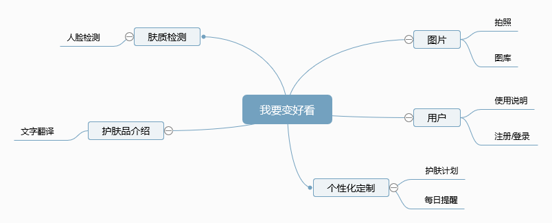

 |  发布日期 | 2018-11-24 |
 | -- | -- |
 |  史诗名称 | 一款脸部私人美容师app |
 |  文件现状 | 进行中 |
 |  文件的主人 | 陈嘉琳 |
 |  领头的设计师 | 陈嘉琳 |
 |  领头的开发者 | 陈嘉琳 |
 |  领头的测试者 | 陈嘉琳  |

## 目标: 
1. 使用者用手机拍摄脸部照片，分析用户脸部状况
2. 个性化定制用户护肤计划，增设每日提醒功能
3. 拍任何护肤品的说明让用户详细了解该护肤品的详细成分介绍和使用方法

## 背景: 
现在社会无论男和女非常注重自己的容貌，护肤品化妆品剁手根本停不下来。不过自己的皮肤到底好不好？肤质适合怎样的护肤品与化妆品？恐怕并不是每个人都心中有数。照镜子看皮肤比较粗暴简单效果一般，去专业机构测试又嫌麻烦，怎么才可以进一步了解自己的皮肤状况怎么？更重要的是对于喜欢长痘痘的脸，如何判断出自己脸上究竟长得是何种痘痘，需要如何整治真的是很困惑呢。所以这款APP将为你解决以上这些困扰。

## 假设: 
1. 用户：用户主要在移动端使用这款APP，方便拍照上传，并且利用后置摄像加闪光灯使得拍摄更为清晰
2. 技术：人脸检测识别、机器翻译
* 通过特征提取模块将摄像头所传输的图片中的痘痘、黑头、毛孔等识别出来；
* 通过数据分析模块将图片中的痘痘进行处理得出患者脸部的痘痘、黑头、毛孔等数量及位置；

## 需求:
 |  用户案例 | 对应标题 | 重要程度 |
 | -- | -- | -- |
 |  分不清自己是油性还是干性皮肤？ | 人脸检测 | 重要 |
 |  痘痘肌分不出自己长得是哪种痘痘？ | 人脸检测 | 重要 |
 |  买的是日本的洗面奶看不懂说明怎么办？ | 文字翻译 | 次要 |

## 使用者交互及设计：

## 问题: 
1. 如何快速检测脸部皮肤状况呢？
3. 如何护肤品的介绍上的陌生的语言快速转换为中文呢？

## 不做: 
不对护肤品的成分介绍的专有名词进行解释

