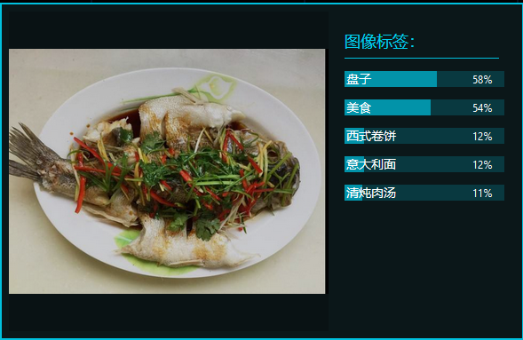

 |  发布日期 | 2018-11-24 |
 | -- | -- |
 |  史诗名称 | 放心食 |
 |  文件现状 | 进行中 |
 |  文件的主人 | 陈嘉琳 |
 |  领头的设计师 | 陈嘉琳 |
 |  领头的开发者 | 陈嘉琳 |
 |  领头的测试者 | 陈嘉琳  |

## （一）加值宣言：
经过调查，可发现目前已有不少菜谱类APP、美食直播、视频图文教做菜、分享美食、交流心得、在线商城购买食材等美食类APP，例如"香哈菜谱","下厨房"等。但是随着人工智能的发展，人们开始发现AI更懂你的胃。事实证明简单的菜谱搜索和制作教程搜索已经不是难事，但是市面上这些应用都还有没有可以拍照进行识别菜品和菜品卡路里以及识别果蔬的功能。基于现状，现将采用百度的菜品识别API和果蔬识别API对现有产品进行加值和优化。 主要：运用了机器学习中视觉技术的细粒度图像识别的菜品识别功能，通过即对于输入的一张图片（可正常解码，且长宽比适宜），输出图片的菜品名称、卡路里信息、置信度。辅助：还运用了机器学习中视觉技术的果蔬类食材识别，该请求用于识别果蔬类食材，即对于输入的一张图片（可正常解码，且长宽比适宜），输出图片中的果蔬食材结果。

## （二）核心价值：（最小可行性产品）
着眼于用户的最基本需求，解决用户想要知道美食的名称的问题，同时提供计算出美食卡路里的最基础服务。

## （三）背景：
对于美食有分三种情况：喜欢做、喜欢吃以及喜欢拍美食。而目前美食产品的发展趋势分别往这三个方面发展，一个是菜谱检索类产品，一个是餐厅点评类产品，还有一个就是专门拍美食相机APP。常言道；‘民以食为天’，而对于现在越来越讲究养生的80、90后来说，健康的饮食也是极为重要的。如果可以有一个美食产品，可以让用户一键操作便知道美食的介绍、卡路里和营养成分，这也许是为用户提供健康饮食的好帮助。

## （四）目的：
做一个让你不再苦恼吃食的小程序——放心食 

## （五）目标：
- 前期目标：
1. 拍下任何美食，得出是何种菜品，计算出食物卡路里。
2. 拍下果蔬，判断是何种果蔬。
3. 输入菜品名称，列出菜品的详细制作过程。提前预算合成一道菜之后的卡路里。

- 后期目标：（目前不做）
1. 拍下食材，了解食物的新鲜程度，并设有提醒用户及时食用功能。
2. 用户在厨房或超市里拍下任何食材的照片，给你量身定制的食谱建议。
3. 拍下食物计算出营养成分（碳水化合物、蛋白质、脂肪、纤维素、糖分）； 识别菜品计算价钱

## （六）用户：
吃货、减肥者、健身者、家庭主妇、厨房小白、疾病患者

## （七）用户痛点：
- 场景一：看到美食，既想狂吃，但又担心长胖。
- 场景二：要疯狂克制卡路里的摄入，担心卡路里摄入不够或者偏多。
- 场景三：想自己制作美食，脑子里完全没有思绪要怎么做。
- 场景四：生病了什么都要忌口，是不是就与美食无缘了呢。
- 场景五：在菜市场无法分辨妈妈让买的是哪种青菜，很尴尬怎么办。
- 面对美食，我们有没有更好的应对方法呢？

## （八）AI产品概率性与用户痛点：
百度视觉技术的图像识别技术，有三大保证：
1.	稳定性好提供24小时云端高稳定服务，宕机率低，故障恢复快，单图毫秒级响应，服务可用性高达99.95% 
2.	准确度高：基于百度丰富的海量数据，利用深度学习技术及精准的算法迭代模型，不断提高准确性 
3.	功能丰富：支持上千种物体识别及场景识别，并在持续增加中，让你更好的读懂世界。

所以，该产品利用了菜品识别通过现场拍的菜品照片列出菜品名称、菜品卡路里信息、菜品介绍，果蔬识别通过现场拍的果蔬照片识别出果蔬的名称品种。这两个功能技术转换精确率较高，普遍情况下都可以使用。该产品因环境因素或者拍照造成识别不准确的状况，概率较小为少数事件，对正面影响并不大。
- 拍照识别不准确解决办法：[数字图片识别程序](https://blog.csdn.net/weixin_40897235/article/details/83087413)、机器自身的深度学习

## (九)API使用风险评估
- AI错误率：
>> 目前人类对ImageNet图像的识别错误率大约在5%，微软的人工智能系统的错误率为4.94%，谷歌为4.8%。百度在2015年的时候已将这一错误率进一步降至4.58%，实现了质的飞跃。 [原文链接](http://tech.ifeng.com/a/20150512/41080218_0.shtml)

- 错误现象处理办法：
1. 当菜品识别错误的话，可以把用户拍的照片与数据库里已有相似度最高的照片让用户比较出两张图的不同并且圈出不同之处，或者手动输入不同处的关键词，帮助机器学习更正自己来给用户最正确的答案。
2. 当果蔬识别失败的话，就用幽默的方式告诉用。第一次识别错误：‘因为近视无法识别清楚果蔬，请您在光亮充足的地方拍出更清晰的照片’；第二次识别错误：‘因为学习不用功，忘记了这个东西的名称，可以发送反馈留言，后台客服妹妹将为您亲自解答。’
3. 计算卡路里不正确时，接受到用户反馈后，提示用户：'这次数学考试又不及格了，请主人不要举报我，我现在再去算一遍。'


## （十）使用者交互与设计（axure产品原型）
### [原型文档]()
1. 登录/授权页面

2. 拍照模块

3. 菜谱模块

4. 我模块


## （十一）产品结构图
1. 产品功能结构图

2. 产品信息结构图

3. 产品流程图

4. 产品结构图


## （十二）用户需求:（使用的人工智能要反映到需求列表中）
| 用户案例	| 对应标题	| 重要程度 |
| -- | -- | -- |
| 用户想知道食物的卡路里 	| 菜品识别 	| 重要 |
| 用户想知道照片上的菜品名称和菜品介绍	| 菜品识别	| 重要 |
| 用户想辨识果蔬，知道果蔬的名称 | 果蔬识别 | 次重要 |
| 用户想知道菜品的制作教程	|   | 次重要 |

### 具体应用场景
1. 在家里，女儿小红已经比同龄人正常体重超了很多，妈妈为了严格控制她的卡路里摄入很是苦恼，一个个计算好像很花费时间。但是，妈妈最近发现了一个新的APP，可以帮助她减轻负担。她拿出了手机，点开了放心食APP，对今天的午饭拍了个照片，自动识别出了美食的卡路里。
2. 在咖啡厅，小红和朋友正在做去长沙的美食攻略，看到一张图片想知道它的菜名。她拿出了手机，点开了放心食APP，对图片拍了个照片，自动识别出了美食的名称和介绍。
3. 在菜市场，妈妈今天加小红买几种青菜回来，小红不知道那些青菜长什么样，又不想问店主。她拿出了手机，点开了放心食APP，对拿起的果蔬拍了个照片，自动识别出了果蔬的名称。


## （十三）API的运用：
1. 百度API：
细粒度图像识别——菜品识别
* 接口描述：该请求用于菜品识别。即对于输入的一张图片（可正常解码，且长宽比适宜），输出图片的菜品名称、卡路里信息、置信度。
* 接口地址：https://aip.baidubce.com/rest/2.0/image-classify/v2/dish
* 请求方法：POST
```
代码示例：
import requests
import json
import base64
import urllib
from aip import AipImageClassify

def get_access_token():
     #这里添上自己的app数据就ok
     APP_ID = 'xxx'
     API_KEY = 'xxx'
     SECRET_KEY = 'xxx'

     url = 'https://aip.baidubce.com/oauth/2.0/token?grant_type=client_credentials&client_id=%s&client_secret=%s' % (API_KEY, SECRET_KEY)
     response = requests.post(url)

     access_token = response.content.decode('utf-8')
     access_token = json.loads(access_token)

     access_token = str(access_token['access_token'])

     return access_token

def get_file_content(filePath):
     with open(filePath,'rb') as fp:
          return fp.read()

def get_recognization(access_token):
     host = 'https://aip.baidubce.com/rest/2.0/image-classify/v2/dish?access_token=' + access_token
     header = {'Content-Type' : 'appliapplication/x-www-form-urlencodedcation/x'}
     
     #这里改成自己的文件路径
     image = get_file_content('/home/pi/pythoncode/download.jpg')
     image = base64.b64encode(image)
     body = {'image' : image, 'top_num' : 1}
     body = urllib.parse.urlencode(body)

     response = requests.post(host,data=body,headers=header)
     response = json.loads(response.text)
     name = response['result'][0]['name']

     return name     
def main():
     at = get_access_token()
     recognization = get_recognization(at)
     print(recognization)
     
if __name__ == '__main__':
     main()
```
- 百度菜品识别测试结果
单一菜品

输入一张美食图片，都是输出五个置信度最高的结果。
多种菜品

判断结果为‘非菜’

- 腾讯菜品识别测试结果


- 阿里图像识别测试结果


- 百度与腾讯与阿里云的比较
1. 百度菜品API，只能识别单一的菜色，对于多食物的照片无法识别；提供食物的热量信息。
2. 腾讯菜品识别API，目前还没有提供关于美食菜品识别和热量计算的API,输入的图片只反馈图片是否为美食。
3. 阿里云只有开放图像识别API，输入的图片，输出的是图像标签。

细粒度图像识别—果蔬类食材识别
* 接口描述：该请求用于识别果蔬类食材，即对于输入的一张图片（可正常解码，且长宽比适宜），输出图片中的果蔬食材结果。
* 接口地址：https://aip.baidubce.com/rest/2.0/image-classify/v1/classify/ingredient
* 请求方法：POST
```
代码示例
# encoding:utf-8
import base64
import urllib
import urllib2

request_url = "https://aip.baidubce.com/rest/2.0/image-classify/v1/car"

# 二进制方式打开图片文件
f = open('[本地文件]', 'rb')
img = base64.b64encode(f.read())

params = {"image":img,"top_num":5}
params = urllib.urlencode(params)

access_token = '[调用鉴权接口获取的token]'
request_url = request_url + "?access_token=" + access_token
request = urllib2.Request(url=request_url, data=params)
request.add_header('Content-Type', 'application/x-www-form-urlencoded')
response = urllib2.urlopen(request)
content = response.read()
if content:
    print content
```

2. 菜谱API：
* 接口描述：该请求用于列出菜品的制作过程，即对于输入查询的菜谱名（可正常解码，且长宽比适宜），输出对应的菜谱制作过程。
* 接口地址：http://apis.haoservice.com/lifeservice/cook/query
* 请求方法GET/POST
```
代码示例

```

## 需求列表与人工智能API加值：（产品的可行性）
1. 该产品是个小程序，体量不会很大，不需要用户下载APP占用手机内存。
2. 该产品需求明确，需求针对的目标用户群体广泛，有吃货、减肥者、健身者、家庭主妇、厨房小白、疾病患者。
3. 该产品有核心功能和辅助功能，功能多样化。
4. 该产品解决了用户想要计算卡路里的问题，果蔬识别的问题。


## 交互需求：
1.	输入框：若输入框有默认提示，点击输入框，弹出软键盘；当输入框内不为空（空格除外）时，默认显示消失
2.	软键盘的弹出及退出机制：当输入框内必须输入的为数字时，弹出数字软键盘，其余时候，弹出文字软键盘；当在软键盘以外区域，点击或向下滑动时，软键盘退去
3.	小黑块提示：显示2秒，然后自动消失
4.	当涉及到下载或其他很耗费流量的操作时，会进行2G/3G网络还是wifi网络的判断，当判断出是非wifi时，会进行提醒。其他需要向后台请求数据时，只进行简单的网络状况是否良好的判断，当网络状况不良时进行提示。

## 异常流：
1.	如果计算卡路里不成功，给出具体字段的错误提示信息，让用户重新调整好光亮度和角度重新拍摄；
2.	如果拍照识别的菜品不正确，提示用户可以手动选择和更改。
3.	如果用户不满意个性化推荐的食谱，弹出更换提示。

## 非功能性需求：
1.	性能：估计用户数为1万人，每天登录用户数为3000左右，网络的带宽为100M带宽。在非高峰时间根据编号和名称特定条件进行搜索，可以在3秒内得到搜索结果。当通过互联网接入系统的时候，期望在编号和名称搜索时最长查询时间<15秒。
2.	可靠性：我们要求系统7x24小时运行，全年持续运行故障停运时间累计不能超过10小时。
3.	可维护性：故障的可排查能力，系统的修正，升级，备份，恢复机制。
4.	安全：如用户权限、动态口令、数据库字段加密等。
5.	易用性： 简洁的UI设计、符合用户的使用习惯。
6.	数据一致性：当发生注册信息变更时，保证多处地方记录的信息都被修改。

## 结果预期：
上线初期，通过对部分使用者的体验评价再面向整个市场推出使用，到后期全面广泛应用，不断积攒用户。发展到一定阶段，小程序会接手广告业务获利，最终扎根市场，开启用户与企业双赢模式。

